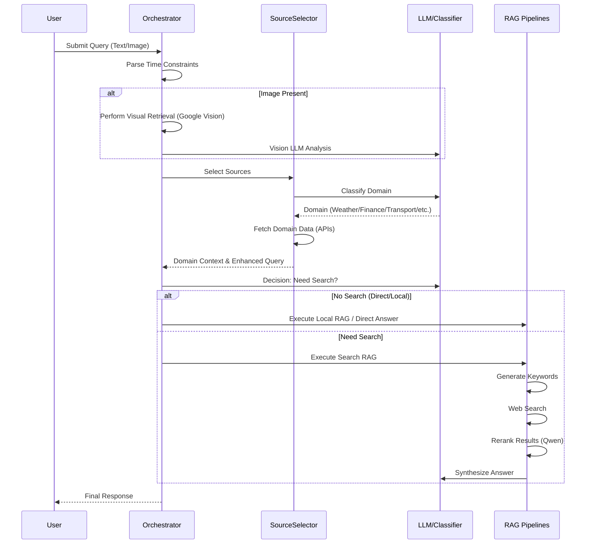

# Intelligent Search Engine (ISE) System Architecture

## 一：系统架构

### 1. 系统架构图

#### High-Level Architecture
```mermaid
graph TD
    User[User] -->|Query| Server[Flask API Server]
    Server -->|Orchestrate| Orchestra[Smart Search Orchestrator]
    Orchestra -->|Analyze| Time[Time Parser]
    Orchestra -->|Classify & route| Selector[Intelligent Source Selector]
    Selector -->|Domain Data| APIs[External APIs (Google/Finance/Weather)]
    Orchestra -->|Decision| Router{Search Check}
    Router -->|No| LocalRAG[Local RAG Pipeline]
    Router -->|Yes| SearchRAG[Search RAG Pipeline]
    LocalRAG -->|Retrieve| VectorDB[(FAISS Vector Store)]
    SearchRAG -->|Search| SearchAPI[SerpAPI / Google / You]
    SearchRAG -->|Rerank| Reranker[Qwen Reranker]
    SearchRAG -->|Synthesize| LLM[LLM (GLM-4)]
    LocalRAG -->|Synthesize| LLM
    LLM -->|Response| User
```

#### Advanced Logic Flow


### 2. 技术栈 (Technology Stack)

*   **Backend Framework**: Flask (Python)
*   **LLM Provider**:
    *   **Primary**: GLM-4.6 (ZhipuAI/Zai) - Default for generation.
    *   **Routing/Classification**: GLM-4.5-air - Optimized for speed/cost.
    *   **Vision Support**: Google Vision API + Vision-capable LLMs.
*   **Vector Database**:
    *   **Implementation**: LangChain VectorStore (FAISS based).
    *   **Embeddings**: HuggingFace (`all-MiniLM-L6-v2`).
*   **RAG Engine**:
    *   **Framework**: LangChain (Community & Core).
    *   **Retrieval**: Dense retrieval with similarity search.
*   **Reranking**:
    *   **Model**: Qwen3-rerank (Alibaba DashScope).
*   **Search & Data Sources**:
    *   **Web**: SerpAPI, You.com, Google Custom Search.
    *   **Domain APIs**: Google Weather/Routes/Places, Finnhub, Yahoo Finance, TheSportsDB.
    *   **MCP**: Support for Model Context Protocol servers.

---

## 二：方法论与实现细节 (Methodology and Implementation Details)

本章节详细阐述了系统的核心方法论与具体实现细节。系统设计采用了模块化、分层架构，通过各组件的协同工作实现智能化、精准化的信息检索与生成。

### 1. 智能选择与动态路由 (Intelligent Selection & Dynamic Routing)

系统核心采用了一个混合决策机制（Hybrid Decision Mechanism），由 `search/source_selector.py` 中的 `IntelligentSourceSelector` 类实现。该机制旨在根据用户的自然语言查询精准地路由到最合适的数据获取渠道，平衡了响应速度、成本与回答质量。

*   **双层分类架构 (Two-Layer Classification Architecture)**:
    1.  **LLM 语义分类 (Semantic Classification)**: 系统首先尝试调用轻量级 LLM (配置为 `GLM-4.5-air`) 执行语义意图识别。使用的 System Prompt 明确定义了七大核心领域：`weather` (天气), `transportation` (交通), `finance` (金融), `sports` (体育), `temporal_change` (时序变化), `location` (地理位置), 以及 `general` (通用)。 Prompt 强制模型输出严格的 JSON 格式（如 `{"domain": "finance"}`），确保下游处理的确定性。
    2.  **关键词规则回退 (Keyword-based Fallback)**: 为了提高系统的鲁棒性，当 LLM 调用超时或返回非标准格式时，系统会自动降级到 `_classify_with_keywords` 方法。该方法维护了一个详尽的 `domain_keywords` 字典（例如，"股价"、"PE"、"市值" 映射到 `finance` 领域；"比分"、"排名"、"NBA" 映射到 `sports` 领域），通过高效的字符串匹配兜底。

*   **领域专用数据源 (Domain-Specific Sources)**:
    针对识别出的特定领域，系统集成了专门的 API 以提供比通用网页搜索更结构化、更权威的数据：
    *   **Weather**: 集成 **Google Weather API** (`weather.googleapis.com`)，获取实时气温、降水概率及未来预报。
    *   **Finance**: 集成 **Yahoo Finance** (`yfinance`) 和 **Finnhub**，能获取实时股价、公司财报及市场指数。
    *   **Sports**: 集成 **TheSportsDB** 和 **API-Football**，支持查询球队阵容、历史比分及实时赛况。
    *   **Transportation/Location**: 集成 **Google Routes API** 和 **Google Places API**，处理导航规划与地点检索。

*   **查询增强 (Query Enhancement)**:
    在确定领域后，`generate_domain_specific_query` 方法会对原始查询进行“上下文中注入”。例如，对于 `sports` 领域查询，会自动追加 "latest stats, rankings, team roster" 等后缀；对于 `temporal_change` 查询，会补充 "historical data year over year" 等提示词，显著提升了检索结果的相关性。

### 2. 本地 RAG 架构与实施 (Local RAG Architecture & Implementation)

本地检索增强生成 (Local RAG) 模块旨在利用私有知识库回答问题，确保数据隐私并弥补通用大模型的知识盲区。该模块在 `rag/local_rag.py` 及 `langchain/langchain_support.py` 中实现。

*   **文档处理流水线 (Document Processing Pipeline)**:
    *   **加载器 (Loaders)**: `FileReader` (现由 `LangChainFileReader` 支持) 能够递归扫描指定目录，支持多种文件格式的解析：
        *   `.pdf`: 使用 `PyPDFLoader` 提取文本。
        *   `.md`: 使用 `UnstructuredMarkdownLoader` 解析 Markdown 结构。
        *   `.txt`: 使用 `TextLoader` 处理纯文本。
    *   **文本分块 (Text Splitting)**: 使用 `RecursiveCharacterTextSplitter` 进行精细化分块。经过实验调优，参数设定为 `chunk_size=1000` (字符) 和 `chunk_overlap=200`。这种配置既能保证每个块包含完整的语义段落，又能通过 20% 的重叠区防止关键信息被切断。

*   **向量索引与存储 (Vector Indexing & Storage)**:
    *   **Embedding 模型**: 选用 `all-MiniLM-L6-v2` (通过 `HuggingFaceEmbeddings` 加载)。该模型在保持极高推理速度的同时，在语义相似度任务上表现优异，生成 384 维的稠密向量。
    *   **向量数据库**: 底层采用 **FAISS (Facebook AI Similarity Search)**。`LangChainVectorStore` 类封装了 FAISS 的索引构建 (`index` 方法) 与持久化操作，支持在 CPU 环境下进行毫秒级的高效近邻搜索。

*   **检索与生成 (Retrieval & Generation)**:
    *   系统执行相似度搜索 (`similarity_search`)，默认检索 Top-5 最相关的文档块 (`k=5`)。
    *   检索到的文本块被拼接成一个 Context 字符串，并注入到 LLM 的 Prompt 中：*"基于以下已知信息...请回答用户问题"*。这种 In-Context Learning 的方式有效抑制了大模型的幻觉。

### 3. 多阶段检索优化：重排序与过滤 (Multi-stage Retrieval Optimization: Reranking & Filtering)

为了解决传统搜索引擎返回结果中存在的噪声问题，本系统在 `rag/search_rag.py` 和 `search/rerank.py` 中引入了先进的 **Re-ranking (重排序)** 机制。

*   **初筛阶段 (Initial Retrieval)**:
    `SearchRAG` 模块通过集成 SerpAPI、You.com 或 Google Custom Search API，首先获取较广泛的候选结果集 (通常为 Top-10 或 Top-20)。这些结果 (`SearchHit` 对象) 包含标题、URL 和简短摘要。

*   **重排序模型 (Reranking Model)**:
    系统实现了 `Qwen3Reranker` 类，对接阿里云 DashScope 的 `qwen3-rerank` 模型。不同于仅基于向量距离的粗排，Cross-Encoder 架构的 Rerank 模型会同时接收 Pair 对 (User Query, Document Chunk)，通过深层交互注意力机制计算相关性分数。
    *   **数据流**: 搜索结果被格式化为 `[{"query": "...", "content": "..."}]` 列表并发送至 API。
    *   **鲁棒性设计**: `_extract_ranking` 方法包含完整的错误处理逻辑，若 Rerank API 调用失败，系统会自动降级回退到原始搜索排序，确保服务的高可用性。

*   **智能过滤策略 (Intelligent Filtering Strategy)**:
    经过重排序后，系统执行严格的过滤逻辑以保证上下文质量：
    1.  **阈值过滤**: 只有 relevance score 高于 `min_rerank_score` (默认 0.0，可调优) 的结果才会被保留。
    2.  **多样性控制**: 引入 `max_per_domain` 参数 (默认 1)，限制来自同一域名的结果数量。这有效防止了单一来源 (如维基百科) 占据所有上下文窗口，迫使模型参考多元化的信息源。

*   **时序查询的细粒度回退 (Granular Fallback for Temporal Queries)**:
    针对 "QS ranking 2015-2023" 这类复杂的时序变迁查询，系统实现了 `_perform_granular_search_fallback`。如果初次宽泛搜索未能覆盖所有请求的年份，系统会通过 LLM 生成一系列特定年份的子查询 (e.g., "QS world university ranking 2015 CUHK", "QS world university ranking 2016 CUHK")，并行执行检索，最后将结果聚合。这种 "Scatter-Gather" 模式极大增强了系统处理纵向数据对比的能力。

### 4. Agent Workflow与多步推理 (Agent Workflow & Multi-step Reasoning)

`orchestrators/smart_orchestrator.py` 中的 `SmartSearchOrchestrator` 充当了系统的“大脑”，协调感知、决策、执行与反思的完整 Agent 工作流。

*   **时间感知与解析 (Time Awareness & Parsing)**:
    内置的 `TimeParser` 工具 (`utils/time_parser.py`) 利用正则表达式能够精准识别自然语言中的时间限制 (如 "最近3天", "past 6 months")。解析出的 `TimeConstraint` 对象会被转换为搜索引擎接受的参数 (如 Google 的 `tbs=qdr:d3` 或 You.com 的 `freshness=month`)，从源头保证信息的时效性。

*   **决策与编排 (Decision & Orchestration)**:
    *   **Search Check**: 在处理非领域特定查询时，Orchestrator 会调用 LLM (`DECISION_SYSTEM_PROMPT`) 进行二元分类，判断查询是否需要联网。这避免了对简单常识性问题 (如 "你好", "主要颜色的定义") 进行不必要的网络搜索，降低延迟。
    *   **上下文注入 (Context Injection)**: 这是一个关键的中间步骤。如果 Source Selector 获取到了结构化的领域数据 (如 API 返回的股票实时数据)，这些数据会作为 "Pre-context" 注入到 Prompt 中。LLM 被要求优先基于这些硬数据回答，并利用网络搜索结果作为定性补充。

*   **反思与闲聊处理 (Reflection & Small Talk)**:
    系统内置了 `_looks_like_small_talk` 启发式规则，快速拦截单纯的问候语。对于复杂任务，若单次搜索结果不足以回答，Agent 逻辑允许触发回退机制或生成澄清性追问。

### 5. 多模态交互与视觉理解 (Multi-modal Interaction & Visual Understanding)

系统突破了纯文本的限制，在 `server.py` 和 Orchestrator 中构建了完整的多模态处理链路。

*   **视觉检索流水线 (Visual Retrieval Pipeline)**:
    当用户上传图片时，系统不仅是“看”图片，而是将其转化为可检索的信号：
    1.  **特征提取**: 调用 **Google Vision API** 的 `label_detection` 和 `web_detection` 端点。
    2.  **元数据转换**: 从 API 响应中提取 "Best Guess Labels" (最佳猜测标签) 和 "Web Entities" (网络实体)。
    3.  **语义增强**: 这些提取出的文本标签 (e.g., "Eiffel Tower", "Parisian Architecture") 被直接追加到用户的原始文本查询中。这使得系统能够基于图片内容进行网络搜索，即使各类 LLM 不具备视觉能力，也能通过这些精准的文本标签理解图片背景。

*   **自适应模型策略 (Adaptive Model Strategy)**:
    系统根据当前配置的 LLM 能力动态调整 Prompt 策略：
    *   **Vision-Native LLMs**: 对于原生支持视觉的模型 (如 GPT-4V)，图片以 Base64 编码直接嵌入消息体。
    *   **Non-Vision LLMs**: 对于仅支持文本的模型，系统会自动构建一个包含 *"Image Context derived from Google Vision: [Labels]..."* 的 System Prompt。这种桥接设计确保了系统在切换不同底层模型时，多模态功能的体验一致性。
