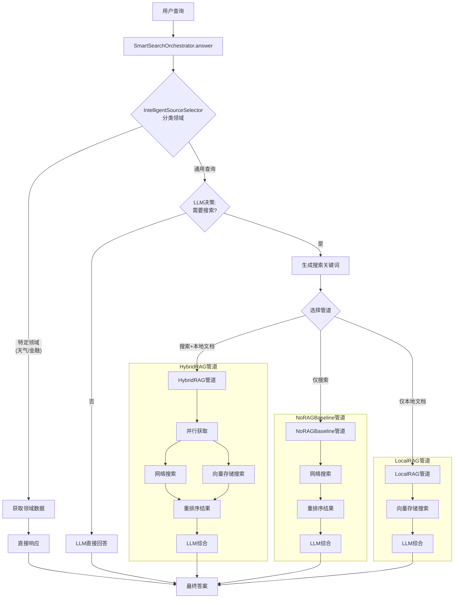

# NLP智能搜索引擎项目开发规范文档

## 1. 项目概述

本项目是一个基于检索增强生成(RAG)技术的智能搜索引擎，能够理解用户意图，动态选择数据源，并执行复杂工作流程以提供精确、上下文感知的答案。系统支持多种LLM提供商，具备本地知识库、网络搜索、结果重排序和多模态支持等功能。

## 2. 项目架构

### 2.1 整体架构

项目采用模块化设计，主要包含以下核心组件：

```
NLP_Project/
├── 核心模块/
│   ├── main.py                 # 主入口，处理命令行参数和配置
│   ├── smart_orchestrator.py   # 智能编排器，决定搜索策略
│   ├── source_selector.py      # 智能源选择器，分类查询领域
│   └── api.py                  # LLM API客户端封装
├── RAG模块/
│   ├── hybrid_rag.py           # 混合RAG实现(网络+本地)
│   ├── local_rag.py            # 本地RAG实现
│   └── no_rag_baseline.py      # 无RAG基线实现
├── 搜索模块/
│   ├── search.py               # 搜索客户端集合
│   └── rerank.py               # 结果重排序模块
├── 工具模块/
│   ├── time_parser.py          # 时间约束解析
│   ├── timing_utils.py         # 性能计时工具
│   └── sports_api.py           # 体育数据API
├── 服务模块/
│   ├── server.py               # Web服务器
│   └── api.py                  # API接口
├── 前端/
│   ├── index.html              # 主页面
│   ├── script.js               # 前端脚本
│   └── styles.css              # 样式表
└── 配置文件/
    ├── config.example.json     # 配置示例
    └── requirements.txt        # 依赖列表
```

### 2.2 工作流程

系统工作流程如下图所示：



## 3. 核心模块详解

### 3.1 智能编排器 (smart_orchestrator.py)

**功能**: 作为系统的核心协调器，决定是否需要搜索以及使用哪种搜索策略。

**主要类**:
- `SmartSearchOrchestrator`: 主协调器类

**关键方法**:
- `answer()`: 处理用户查询的主入口
- `_decide_search_strategy()`: 决定搜索策略
- `_generate_search_keywords()`: 生成搜索关键词
- `_execute_pipeline()`: 执行选定的RAG管道

**开发规范**:
- 所有决策过程应记录日志
- 性能关键路径需使用`TimingRecorder`计时
- 错误处理应优雅，提供有意义的错误信息

### 3.2 智能源选择器 (source_selector.py)

**功能**: 根据查询内容自动选择最合适的数据源。

**主要类**:
- `IntelligentSourceSelector`: 智能源选择器

**关键方法**:
- `classify_domain()`: 分类查询领域
- `select_sources()`: 选择数据源

**开发规范**:
- 支持的领域包括：天气、交通、金融、通用查询
- 新增领域时需更新分类逻辑和相应的API调用
- 领域分类应使用轻量级模型以提高响应速度

### 3.3 RAG模块

#### 3.3.1 混合RAG (hybrid_rag.py)

**功能**: 结合网络搜索和本地文档的RAG实现。

**主要类**:
- `HybridRAG`: 混合RAG实现

**关键方法**:
- `search_and_answer()`: 执行搜索并生成答案
- `_parallel_fetch()`: 并行获取网络和本地数据
- `_merge_and_rerank()`: 合并和重排序结果

#### 3.3.2 本地RAG (local_rag.py)

**功能**: 仅使用本地文档的RAG实现。

**主要类**:
- `LocalRAG`: 本地RAG实现

**关键方法**:
- `search_and_answer()`: 执行本地搜索并生成答案
- `_vector_search()`: 向量存储搜索

#### 3.3.3 无RAG基线 (no_rag_baseline.py)

**功能**: 仅使用网络搜索的基线实现。

**主要类**:
- `NoRAGBaseline`: 无RAG基线实现

**关键方法**:
- `search_and_answer()`: 执行网络搜索并生成答案

**RAG模块开发规范**:
- 所有RAG实现应继承自同一基类以确保接口一致性
- 文档处理应支持多种格式(PDF、文本、图像等)
- 向量存储应支持增量更新
- 结果重排序应考虑相关性、可信度和时效性

### 3.4 搜索模块

#### 3.4.1 搜索客户端 (search.py)

**功能**: 提供多种搜索API的统一接口。

**主要类**:
- `SearchClient`: 搜索客户端基类
- `SerpAPISearchClient`: SerpAPI搜索客户端
- `GoogleSearchClient`: Google搜索客户端
- `YouSearchClient`: You.com搜索客户端
- `MCPWebSearchClient`: MCP网络搜索客户端
- `CombinedSearchClient`: 组合搜索客户端

**开发规范**:
- 所有搜索客户端应实现统一接口
- 新增搜索客户端时需继承`SearchClient`基类
- 错误处理应包括重试机制和降级策略
- 搜索结果应标准化为统一格式

#### 3.4.2 重排序 (rerank.py)

**功能**: 对搜索结果进行重排序以提高相关性。

**主要类**:
- `BaseReranker`: 重排序器基类
- `Qwen3Reranker`: Qwen3重排序器实现

**开发规范**:
- 重排序应考虑多种因素：相关性、可信度、时效性
- 支持按域名限制结果数量
- 支持设置最小分数阈值

### 3.5 API客户端 (api.py)

**功能**: 提供多种LLM提供商的统一接口。

**主要类**:
- `LLMClient`: LLM客户端基类
- `OpenAIClient`: OpenAI API客户端
- `AnthropicClient`: Anthropic API客户端
- `GoogleClient`: Google API客户端
- `GLMClient`: GLM API客户端
- `HKGAIIClient`: HKGAI API客户端
- `MiniMaxClient`: MiniMax API客户端

**开发规范**:
- 所有LLM客户端应实现统一接口
- 支持流式响应和非流式响应
- 错误处理应包括重试机制和降级策略
- 支持模型参数配置(温度、最大令牌数等)

### 3.6 工具模块

#### 3.6.1 时间解析器 (time_parser.py)

**功能**: 解析查询中的时间约束。

**主要类**:
- `TimeConstraint`: 时间约束数据类
- `parse_time_constraint()`: 解析时间约束函数

#### 3.6.2 性能计时工具 (timing_utils.py)

**功能**: 记录各组件性能指标。

**主要类**:
- `TimingRecorder`: 性能计时器
- `TimingContext`: 上下文管理器

#### 3.6.3 体育API (sports_api.py)

**功能**: 获取体育相关数据。

**主要类**:
- `SportsAPIClient`: 体育API客户端

**工具模块开发规范**:
- 工具函数应有清晰的输入输出规范
- 错误处理应提供有意义的错误信息
- 性能关键工具应考虑优化

### 3.7 服务模块

#### 3.7.1 Web服务器 (server.py)

**功能**: 提供Web界面和API服务。

**主要类**:
- `FlaskApp`: Flask应用

**关键路由**:
- `/`: 主页面
- `/api/query`: 查询API
- `/api/upload`: 文件上传API

**开发规范**:
- API应遵循RESTful设计原则
- 错误响应应包含标准错误格式
- 支持CORS以允许前端访问

## 4. 配置管理

### 4.1 配置文件结构

项目使用`config.json`进行配置管理，主要包含以下部分：

```json
{
    "LLM_PROVIDER": "glm",
    "domainClassifier": {
        "provider": "glm",
        "model": "glm-4.6"
    },
    "RERANK_PROVIDER": "qwen3-rerank",
    "SERPAPI_API_KEY": "YOUR_SERPAPI_API_KEY_HERE",
    "providers": {
        // 各LLM提供商配置
    },
    "rerank": {
        // 重排序配置
    },
    "mcpServers": {
        // MCP服务器配置
    }
}
```

### 4.2 配置管理规范

- 敏感信息(API密钥等)不应硬编码在代码中
- 配置变更应不需要重启服务(热更新)
- 提供配置验证机制
- 支持环境变量覆盖配置

## 5. 开发规范

### 5.1 代码风格

- 遵循PEP 8 Python代码风格指南
- 使用类型注解提高代码可读性
- 函数和类应有文档字符串
- 复杂逻辑应有注释说明

### 5.2 错误处理

- 使用适当的异常类型
- 错误信息应清晰有用
- 关键路径应有错误恢复机制
- 记录详细的错误日志

### 5.3 测试

- 单元测试覆盖率应达到80%以上
- 集成测试应覆盖主要工作流程
- 性能测试应确保响应时间在可接受范围内
- 提供测试数据集和测试脚本

### 5.4 版本控制

- 使用语义化版本控制
- 提交信息应清晰描述变更内容
- 重要变更应更新文档
- 定期创建发布标签

## 6. 部署指南

### 6.1 环境要求

- Python 3.8+
- 依赖包见`requirements.txt`
- 至少4GB内存
- 网络连接(用于API调用)

### 6.2 部署步骤

1. 克隆代码仓库
2. 安装依赖: `pip install -r requirements.txt`
3. 配置`config.json`文件
4. 运行服务器: `python server.py`
5. 访问`http://localhost:8000`

### 6.3 性能优化

- 使用缓存减少API调用
- 并行处理提高响应速度
- 优化向量搜索算法
- 监控系统资源使用

## 7. 扩展指南

### 7.1 添加新的LLM提供商

1. 在`api.py`中创建新的客户端类，继承`LLMClient`
2. 实现必要的方法
3. 在`config.json`中添加配置选项
4. 在`main.py`中添加提供商支持

### 7.2 添加新的搜索客户端

1. 在`search.py`中创建新的客户端类，继承`SearchClient`
2. 实现必要的方法
3. 在`config.json`中添加配置选项
4. 更新`CombinedSearchClient`以包含新客户端

### 7.3 添加新的领域支持

1. 在`source_selector.py`中更新领域分类逻辑
2. 实现领域特定的API客户端
3. 在`smart_orchestrator.py`中添加领域处理逻辑
4. 更新配置文件以支持新领域

## 8. 维护指南

### 8.1 日志管理

- 使用标准日志模块
- 设置适当的日志级别
- 定期清理旧日志文件
- 监控错误日志

### 8.2 监控

- 监控API调用延迟
- 跟踪错误率
- 监控系统资源使用
- 设置关键指标告警

### 8.3 更新

- 定期更新依赖包
- 关注LLM提供商API变更
- 定期评估和优化性能
- 根据用户反馈改进功能

## 9. 常见问题

### 9.1 API密钥配置

确保所有API密钥正确配置在`config.json`中，并且有足够的配额。

### 9.2 性能问题

如果响应时间过长，考虑：
- 减少搜索结果数量
- 禁用重排序
- 使用更快的模型
- 优化网络连接

### 9.3 内存使用

如果内存使用过高，考虑：
- 减少向量存储大小
- 优化文档处理
- 使用流式处理
- 增加系统内存

## 10. 贡献指南

### 10.1 提交代码

1. Fork项目仓库
2. 创建功能分支
3. 提交变更
4. 创建拉取请求
5. 等待代码审查

### 10.2 代码审查

- 确保代码符合项目规范
- 检查测试覆盖率
- 验证功能正确性
- 评估性能影响

### 10.3 文档更新

- 新功能应更新相关文档
- API变更应更新接口文档
- 配置变更应更新配置文档
- 重大变更应更新发布说明

---

本文档将随着项目的发展持续更新，确保开发团队能够高效协作，维护代码质量，并顺利扩展系统功能。